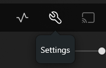

This is a one-time change. Once you set it, Plex will remember it for every video you watch in the browser.

## How to set it up

1. Open [Plex Web](https://app.plex.tv/web) in your browser and sign in.
2. Click the **wrench/settings icon** (⚙) in the top-right corner of the player bar.

   

3. In the left sidebar under **Plex Web**, click **Quality**.

   

4. **Uncheck** `Automatically adjust quality (Beta)`.
5. Under **Internet Streaming**, set **Video quality** to **Maximum**.
6. Under **Home Streaming**, set **Video quality** to **Maximum**.
7. **Check** `Play smaller videos at original quality`.
8. Click **Save Changes**.

   

Why does this help?

By default, Plex sometimes re-encodes video before sending it to your browser, which can lower the quality and cause buffering. Setting quality to Maximum or Original tells Plex to send the file as-is, which means better picture and smoother playback when your browser supports the format.

Still not working?

Browsers have varying codec support. If a file still won't direct play, try a different browser (Chrome and Edge tend to support the most formats). If the issue persists, let your Plex admin know.

